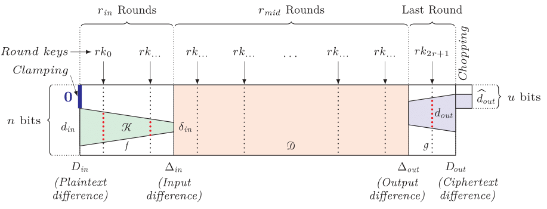

Differential Cryptanalysis of the Reduced Pointer Authentication Code Function used in Arm’s FEAT_PACQARMA3 Feature: Description and User Guide for the Supplementary Material
=========================================================
---

Title: "Differential Cryptanalysis of the Reduced Pointer Authentication Code Function used in Arm’s FEAT_PACQARMA3 Feature"
Implementation: Shibam Ghosh, Roberto Avanzi
Published At: " Transactions on Symmetric Cryptology 2025 Issue 1"
Full Version: "eprint Soon"

---
<p align="center">
  
</p>

## Table of contents

1. [Experimental Verification of Clustering Probabilities and Tweak-Key Dependencies](#experiments)
    1. [Building the programs](#experiments_build)
    1. [Running the programs](#experiments_run)
1. [Search for Characteristics, Clusters, Multiple Differentials](#search)
    1. [Dependencies](#smt_dependencies)
    1. [Running `cryptosmt`](#smt_running)
    1. [Modes](#smt_modes)
    1. [Other command line arguments](#smt_other_arguments)


&nbsp;

The programs included in the `supplementary_material` directory should compile and run on any unix and unix-like system.

We have compiled and used them under `linux` and `macOS`, with both `gcc` and `llvm` (`clang`) C compilers.

&nbsp;

## 1. Experimental Verification of Clustering Probabilities and Tweak-Key Dependencies <a name="experiments"></a>

The `characteristics_verification` directory contains the `C` program to experimentally verify the results presented in **Tables 2, 4, and 5**.

### 1.1 Building the programs<a name="experiments_build"></a>

To create the binaries, run the following commands.
```bash
> make
> cd bin
```
Separate binaries for each characteristic will be generated in the `./bin` directory.

### 1.2 Running the programs<a name="experiments_run"></a>

To verify the results provided in Table 2, execute the commands below:
**Note:** `x*` denotes Equation (x) with the appropriate tweakey condition.

| Equation            | Command              |
|---------------------|----------------------|
| Equation 9          | `./EQ9`              |
| Equation 10         | `./EQ10`             |
| Equation 11         | `./EQ11`             |
| Equation 11'        | `./EQ11_PRIME`       |
| Equation 13         | `./EQ13`             |
| Equation 13*        | `./EQ13_STAR`        |
| Equation 13'        | `./EQ13_PRIME`       |
| Equation 13'*       | `./EQ13_PRIME_STAR`  |
| Equation 15         | `./EQ15`             |
| Equation 15*        | `./EQ15_STAR`        |
| Equation 16         | `./EQ16`             |
| Equation 18         | `./EQ18`             |
| Equation 18'        | `./EQ18_PRIME`       |

To verify the results provided in Table 4, execute the commands below:

| Equation            | Command              |
|---------------------|----------------------|
| Figure 12           | `./FIG12`            |
| Figure 13           | `./FIG13`            |

To verify the results provided in Table 5, execute the commands below:

| Equation            | Command              |
|---------------------|----------------------|
| Figure 12*          | `./FIG12_STAR`       |
| Figure 13*          | `./FIG13_STAR`       |


&nbsp;
&nbsp;

## 2. Search for Characteristics, Clusters, Multiple Differentials <a name="search"></a>

The `SMT` directory contains the programs that we used to find the characteristics used in the paper,
compute clustered probabilities, and find the Multiple Differential used for the case z=4.

The program is derived from Stefan Kölbl's cryptosmt https://github.com/kste/cryptosmt,
but heavily modified to support several features.

### 2.1 Dependencies<a name=smt_dependencies>

`cryptosmt` requires `python` v3, `STP` and `cryptominisat5`
to be installed, as well as a few python packages (if they are not installed, `python` will tell
you which packages it needs).  Some paths are hardwired in `config.py`: if some program is not found
and you actually have installed it, try adding the right paths there.

`STP` is available from https://stp.github.io

`cryptominisat5` is available from https://github.com/msoos/cryptominisat

But we prefer to install them using the Homebrew https://brew.sh package manager. YMMV.

### 2.2 Running `cryptosmt`<a name=smt_running>

To run our program, just cd to the SMT directory in a terminal and type
```
python3 cryptosmt.py
```
cryptosmt will then run with some default parameters. Issue
```
python3 cryptosmt.py --help
```
to get a list of all options.

If the option `--latex` is passed to `cryptosmt`, once a characteristic has been found, cryptosmt will invoke pdflatex
(it is easy to modify search.py to use xelatex or lualatex, and the output should compile)
and place the tex source and output in `paper/fig` `.
As a bonus you get all the tikz commands and macros we use to typeset out figures.

Assuming you have read the help output, let us see some examples:
```
python3 --cipher qarmav1 -r 3 -F 2 -B 2 --latex -k -f 0 -s 12
 ```
runs a search for a maximum probability characteristic
for `QARMAv1`, with just two rounds before the reflector (`-F 2`)
and two rounds after the reflextor (`-B 2`).
Since we ask for `QARMAv1`_3 (`-r 3`) and use the option `-k` (also `--addrecovery`),
the characteristic is extended to a key recovery characteristic to the whole cipher
(the program knows to add two rounds at each end), where the tracing through the added
rounds is truncated, as described in Section 4.1 of the paper.

The search starts at weight 12 (`-s 12`), i.e., probability 2<sup>-12</sup>
using the cost function `p`, i.e., just the probability.
If a characteristic of weight 12 is found, it will be output, otherwise the program will
try to find one of weight 13, then 14, and so on.

If we had used the option `-f 1` in place of `-f 0`, the program would have used the the cost function `p+din`, where
`din` can only be known if we actually compute the extended characteristic.

### 2.3 Modes<a name=smt_modes>

`cryptosmt` can operate in four modes:
```
--mode {0,1,2,3,4}  0 = search characteristic for fixed round
                    1 = compute clustered probability with fixed start differences and truncated end described in yaml file
                    2 = compute probability of truncated differentials
                    3 = like 0 but find characteristics that are representatives of unique starting states
```
It uses mode 0 by default.

Mode 1 is used to compute probability of a differential with an explicitly given start difference at the beginning of the
initial (non-extended) characteristic, and the truncated, chopped ciphertext output.

Mode 2 can be used with the start of the truncated extended characteristic. However, it also accepts also the restriction
at the beginning of the original non-extended characteristic, so... it is mostly the same, and if we pass -f 0 to it in this
case it is identical to Mode 1. But it uses more variables, at least in theory, because the solver probably discards them
anyway.

Mode 3 is interesting because it is similar to the code that was searching explicitly for all characteristics, namely `findAllCharacteristics` in Kölbl's original code.
The latter worked by repeating the search, each time adding a new constraints for each found characteristic to explicitly avoid it.
Once the search returned zero solutions, the weight was increased.
However, we instead only add  the start of the non-truncated differential to the exclusion list.
This way, we get distinct representatives of a multiple differential, where the clusters for each differential in it are pairwise disjoint, and therefore the probability of the multiple differential can be obtained by computing the clustered probabilities of all the found differentials.

Constraints can always be added with the `--inputfile` option. Examples cam be found in the ``cluster_data`` directory.
Any additional option added on the command line after the file override the file. For instance, start and end weights can
be given to partition a clustering search and parallelize it among several threads (warning, `STP` uses a lot of memory,
and it is easy to spawn several processes each one using 40GB of RAM).

### 2.4 Other command line arguments<a name=smt_other_arguments>

Most command line arguments are self-explanatory, and should be easily understood from the ``--help`` message.
Still, a few need an explanation. For instance
```
--zerocellsfront ZEROCELLSFRONT, --zcf ZEROCELLSFRONT
                 parameter is a list LL of lists L of cells for which there should be at least one INACTIVE cell per L - at the beginning of the key-recovery characteristic, for each list L.
```
The list ZEROCELLSFRONT is actually given as a string that python parses. It has a format like ``"[[1,2],[2,3],[4]]"  which means that at the start of the solution: at least one of the cells 1 and 2 must be inactive;
at least one of the cells 2 and 3 must be inactive; and cell 4 must be inactive. The same format is used also for the
`--zerocellsback`,  `--forcecellsfront` and `--forcecellsback` arguments.

`--backsegmentweight WEIGHT LENGTH` means that in the first `LENGTH` cells at the ciphertext output, exactly `WEIGHT` are active, and the other ones
are inactive.

Many options are somewhat overlapping, because they were added according to our needs, not following an ideal of a perfectly orthogonal set of conditions.
For instance, `--customfile` accepts a file with `STP` commands, which can also be given as a string parameter to `--custom`, and of course this is similar to `--inputfile`: just the format is different.
We apologize if some elegance is lost, but this gave us the flexibility we needed.

Some options do not work, such as `--blocksize`, `--wordsize` and `--iterative`.
We just forgot to remove them. We never tried `--boolector`.

`-t TWEAKS` works only with `QARMAv2`.
It allows to model the tweak schedule for the single and double block tweaks.
The option has no meaning for `QARMAv1`.
